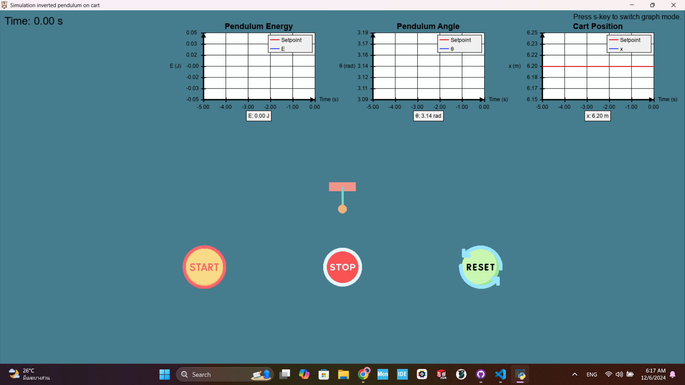
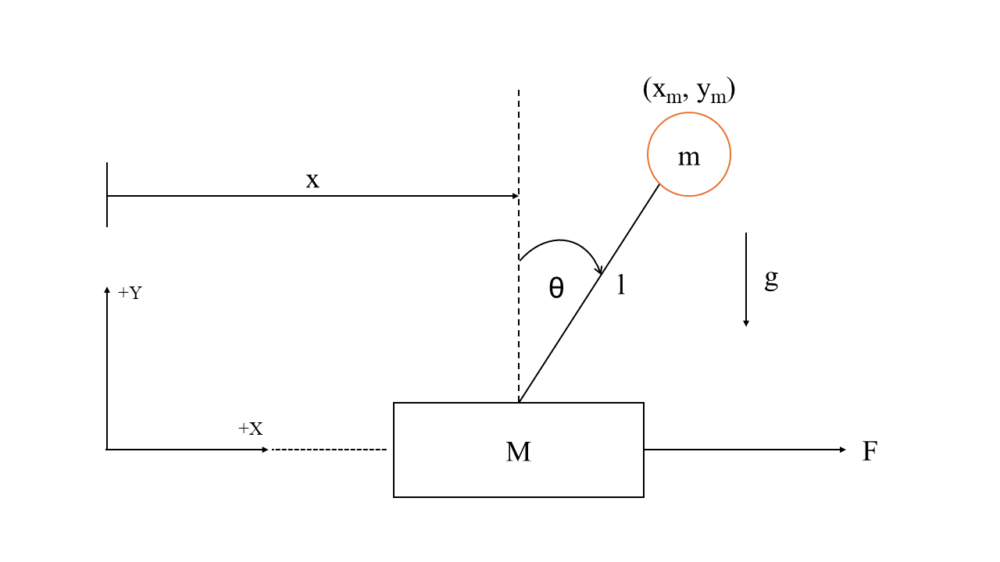
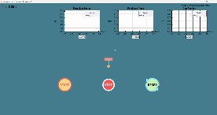

# Inverted-Pendulum-On-Cart
This final project is in FRA333(Kinematics of Robotics System) This project exprain process of Inverted-Pendulum-On-Cart. By using simulation from PyGame.

<p align="center"></p>

### Key components of the project include:
- **Modeling** : Dynamics model of the cart-pendulum system.
- **Controller** : 
    - *Swing-up Controller* : A control strategy applied at the start to add energy to the pendulum, enabling it to swing from the downward position to the upright position.
    - *Stabilized* : Implementation of a PID controller to keep the pendulum stabilized in the upright position.
- **Simulation** : A simulation to visualize the movement of the cart and pendulum and evaluate the performance of the controller.

# Concepts and Theories

1. **Inverted Pendulum on Cart**

    This is an under-actuated mechanical system with highly non-linear dynamics. It consists of a pendulum attached to a cart, where the pendulum can swing freely. The main objective of designing a control system for this setup is to swing the pendulum from the downward position to an upright position and maintain its balance. This is achieved by controlling the horizontal movement of the cart, which is the only available input for stabilizing the pendulum.

2. **Dynamics modeling of Inverted pendulum on cart**
    - FBD Inverted pendulum on cart

        <p align="center"></p>

    - **F** = External force applied to the cart (N)
    - **θ** = Angle of the pendulum (rad)
    - **M** = Mass of the cart (kg)
    - **m** = Mass of the pendulum (kg)
    - **l** = Length of the pendulum (m)
    - **g** = Acceleration due to gravity (m/s²)


-  Kinematic equation of Inverted pendulum on cart

$$x_m = x + l \sin(\theta)$$

$$\dot{x_m} = \dot{x} + l \dot{\theta} \cos(\theta)$$

$$y_m = l \cos(\theta)$$

$$\dot{y_m} = -l \dot{\theta} \sin(\theta)$$

- Calculate Dynamics equation by Lagrangian

    $$L = T - V$$

    - **L** = Lagrangian (No unit)
    - **T** = Kinetic Energy (J)
    - **V** = Potential Energy (J)

- The total kinetic energy of the system :

$$T = \frac{1}{2} (M + m) \dot{x}^2 + m l \dot{x} \dot{\theta} \cos(\theta) + \frac{1}{2} m l^2 \dot{\theta}^2$$

- The potential energy of the system :
    
$$V = m g l \cos(\theta)$$

- So Lagrangian of the system :
    
$$L = \frac{1}{2} (M + m) \dot{x}^2 + m l \dot{x} \dot{\theta} \cos(\theta) + \frac{1}{2} m l^2 \dot{\theta}^2 - m g l \cos(\theta)$$

- Summary 
    - Equation of Motion for the Cart :

        $$\ddot{x} = \frac{F + m l \dot{\theta}^2 \sin(\theta) - m g \cos(\theta) \sin(\theta)}{M + m \sin^2(\theta)}$$

    - Equation of Motion for the Pendulum :

        $$\ddot{\theta} = \frac{g \sin(\theta) - \ddot{x} \cos(\theta)}{l}$$

**3. Energy-based control**

This focuses on adjusting the energy of the system to control its dynamics.
- Nonlinear Equations in Terms of Force :
    
$$F = (M + m \sin^2(\theta)) \ddot{x} - m l \dot{\theta}^2 \sin(\theta) + m g \cos(\theta) \sin(\theta)$$

- Control Law (Energy-Based Control) :
    
$$u = \ddot{x}$$

- Total Energy of the Pendulum :
    
$$E = \frac{1}{2} m l^2 \dot{\theta}^2 + m g l (1 + \cos(\theta))$$

- Energy Required to Reach the Equilibrium
    
$$E_d = m g l (1 + \cos(0)) = 2 m g l$$

- Controller Design
    
$$u = k \dot{\theta} \cos(\theta) \tilde{E}, \quad k > 0$$

- The controller design is divided into 2 phases
    - Phases 1 add Energy if $E<E_d$
    - Phases 2 Remove Energy if $E>E_d$
    - Get
        $$u = \text{sat}_{u_{\text{max}}} \left( k(E - E_d) \text{Sign}(\dot{\theta} \cos(\theta)) \right)$$

    In this equation $u = \ddot{x}$ , But this system is controlled by force, so we need to calculate backwards to convert the control input into force for control the cart.

# Methodology
1. 

# Usage

## Dependencies
To use this project. You need to have all of dependencies for this project.

⚠️**warning**: Make sure you have python version > 3.10 already.

## Installation

1. Clone this repository

    Clone this repository via this command below into your workspace or download it and extract file into your workspace.

    ```
    git clone https://github.com/nakerin7588/Inverted-Pendulum-On-Cart.git
    cd Inverted-Pendulum-On-Cart
    ```

2. Run the Simulation

    Execute the `visualization.py` via this command below.

    ⚠️**warning**: Make sure you are in root folder of your workspcae.

    ```
    python3 .\visualization.py
    ```

## Simulation's features

<div align="center">
  
</div>

* **Start Simulation**
    
    After the simulation window appears, you will see a *Start button*. Click on it to begin the simulation.
    - Initially, the *swing-up controller* will be applied to add energy to the pendulum, attempting to swing it up to an upright position.
    - Next the *Stabilize controller* will attempt to stabilize the pendulum by controlling the cart's movement.

* **Stop Simulation**
    
    While the simulation is running, you can press the *Stop button* to pause the simulation anytime.

* **Reset Simulation**
    
    While the simulation is pausing, you can press the *Reset button* to reset the simulation.

# References

- [INVERTED PENDULUM (Model Based Control Design for Swing-up & Balance the Inverted Pendulum)](https://drive.google.com/file/d/1W2v3wKXBVW4FohB33kTv8iBEiOFgoS8d/view)
- [Swing-up Control of an Inverted Pendulum by Energy-Based Methods](https://www.researchgate.net/publication/3811174_Swing-up_Control_of_an_Inverted_Pendulum_by_Energy-Based_Methods)
- [Cart-pole system : Equations of motion](https://courses.ece.ucsb.edu/ECE594/594D_W10Byl/hw/cartpole_eom.pdf)
- [NON-LINEAR SWING-UP AND STABILIZING CONTROL OF AN INVERTED PENDULUM SYSTEM](https://ieeer8.org/wp-content/uploads/downloads/2011/12/bugeja.pdf)